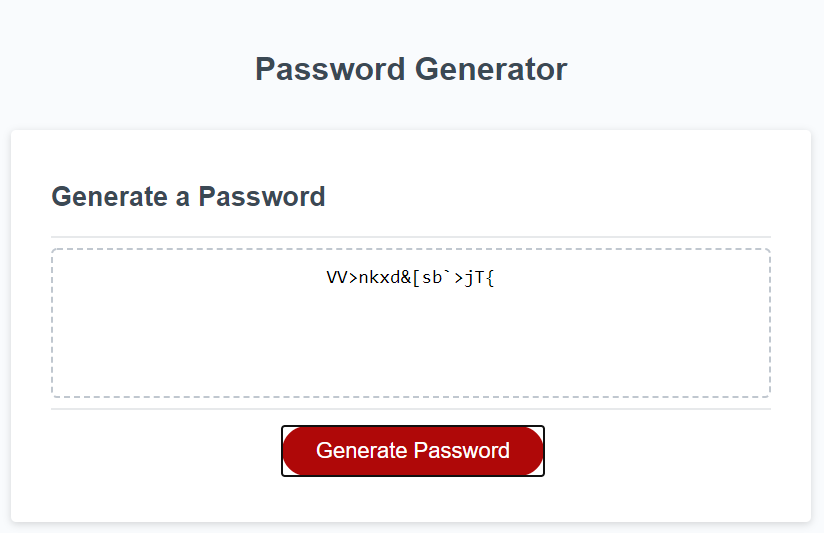

# Password-Generator

## Description

The purpose of this homework was to added functionality to this webpage in order to generate a random password satisfying multiple criteria and within the constaint of 8-128 characters. After which the generated password was to be displayed.

The starter code already had the html and CSS completed, as well as some of the javascript to run the password generator when a button was pressed.

## Examples

To add functionality I created 4 distinct arrays containing every character available to the generator to select from, the 4 arrays satisfied for criteria the user selected including:
- Lower case letters
- Upper case letters
- Numbers
- Special characters

## When the generator ran, it first prompted the user on how it they wanted their password to be:

## If an amount outside of the accepted range or non numeric character was input, the user was alerted with the follower message and the function ceased:

## The user was then prompted with the following criteria, confirming/denying each would create the array the function would ultimately draw from:

  
 

## If none were selected, the user was alerted with the following message and the function ceased:

## If the user entered the correct range and selected their criteria, a randomized password was generated and displayed:

## Final Thoughts:

I had difficulty at first deciding on how to handle the arrays and concatination. Should I create 4 strings and split them later and then concatinate? Should I create 4 seperate arrays and concatinate later, or could I someone create one large string/array and pulled ranges of indices from them to generate this password. I went with creating 4 separate arrays, working with strings may have been cleaner but with arrays this small it seemed like I could save a few lines of code by doing so at least in this case. As far as concatination at the end, my first pass at this I created and if loop with 15 conditionals to check every single combination of booleans to return the final concatinated array for my generator to pull from. I knew this was definitely not the most efficient way to write this code and was able to pare it down to 5 with a little guidance. I was able to complete this assignment in a timely manner and had enough time to go back and make it more efficient and cleaner.

